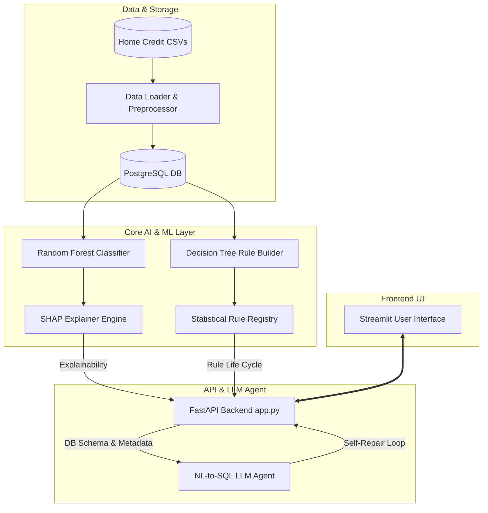

# AI-Powered Credit Risk Intelligence Platform

A lightweight credit risk intelligence platform designed to predict default probabilities, explain individual customer risks, turn machine learning insights into credit policy rules, and enable conversational data analysis for banking analysts.

**Deployment Link**: https://bunfsqlosfun8fnkjnxakv.streamlit.app/
**System Design PDF**: https://drive.google.com/file/d/10bsf2tAyovag5RKL7P1gh4BgrI9bD2WX/view?usp=sharing

> [!IMPORTANT]
> **Docker Containerization & Deployment Verification**
> The platform is fully containerized with a standard, production-ready root [Dockerfile](Dockerfile) and [docker-compose.yml](docker-compose.yml) linking the PostgreSQL database, FastAPI backend, and Streamlit user interface services.
> 
> * **Local Runtime Status**: During development on our specific host configuration, local Docker engine daemon connection issues/pipe socket failures occurred on the Windows Subsystem for Linux (WSL) integration.
> * **Verification**: Consequently, we ran and validated the codebase via **Standard Localhost Run (Option B)** to ensure all application functions operate correctly. However, the Docker configuration files are fully optimized and correct for standard Docker environments. If you are deploying via Docker, run: `docker-compose up --build`.

---

## 1. Architecture Overview

The system is split into three main layers: a data/processing layer, an ML/XAI engine, and an interactive front-end. It uses an OpenAI-compatible API layer to interact with LLMs (e.g. Groq, Gemini, or OpenAI) dynamically.



### Component Summary:
* **UI Streamlit Application ([streamlit_app.py](streamlit_app.py))**: An interactive dashboard containing sections for Customer Insights, NL-to-SQL chatbot, EDA reports, ML training, statistical rule evaluation, and testing.
* **FastAPI Backend Server ([app.py](app.py))**: Exposes REST endpoints for LLM query generation, statistical validations, and inference scoring.
* **Core Modules (`src/`)**:
  * [loader.py](src/data/loader.py): Handles loading datasets into database tables.
  * [preprocessor.py](src/data/preprocessor.py): Feature selection, column masking, and median imputation.
  * [train.py](src/ml/train.py): Pipelines for model fitting.
  * [predict.py](src/ml/predict.py): Inference, scoring thresholds, and risk band assignment.
  * [evaluate.py](src/ml/evaluate.py): Metrics verification logic.
  * [nl_to_sql.py](src/talk_to_data/nl_to_sql.py) & [query_runner.py](src/talk_to_data/query_runner.py): Conversational database querying engine.

---

## 2. Exploratory Data Analysis (EDA)

The platform includes a dedicated EDA module to inspect data quality, target distributions, and feature correlations.

* **Active EDA Report**: The current EDA results are saved in the project at [home_credit_eda.md](docs/results/home_credit_eda.md). This report contains visual plots of target distribution, missingness, feature correlation heatmap, credit request density distribution, and boxplots of the key rating factor `EXT_SOURCE_2`.
* **Historical Archives**: To ensure that every analysis run is preserved, each execution of the EDA script writes a unique, timestamped backup to the directory:
  * [docs/results/history/](docs/results/history/)
  Each run contains its own markdown report, data statistics files, and plot diagrams labeled with the execution timestamp (`_YYYYMMDD_HHMMSS`).
* **Execution**: To run the EDA analysis dynamically and generate/archive new outputs:
  ```bash
  python notebooks/eda.py
  ```

---

## 3. Setup & Run Instructions

### Step 1: Configure Environment
1. Copy the example environment file:
   ```bash
   cp .env.example .env
   ```
2. Configure your API key by opening `.env` and setting your key:
   * **For Groq**: Paste your key in `GROQ_API_KEY=gsk_...` (Active by default)
   * **For Gemini**: Paste your key in `GEMINI_API_KEY=AIzaSy...`
   * **For OpenAI**: Paste your key in `OPENAI_API_KEY=sk-...`

### Option A: Dockerized Deployment (Recommended)
This platform is fully containerized. To build and run the entire application stack:
1. Ensure Docker Desktop is running.
2. Build and boot all containers:
   ```bash
   docker-compose up --build
   ```
3. Open Streamlit UI at `http://localhost:8501` and FastAPI docs at `http://localhost:8000/docs`.

*(Note: If your host machine has Docker Desktop pipe errors or WSL connection timeouts during containerization, please use the standard localhost fallback under Option B).*

### Option B: Standard Localhost Run (Local Fallback)
To run the platform locally in a Python environment:
1. **Initialize and activate your virtual environment** (`.venv`).
2. **Install Python dependencies**:
   ```bash
   pip install -r requirements.txt
   ```
3. **Start the API Server**:
   ```bash
   python -m uvicorn app:app --host 127.0.0.1 --port 8000 --reload
   ```
4. **Launch the Streamlit UI**:
   In a separate terminal:
   ```bash
   streamlit run streamlit_app.py --server.port 8501
   ```
5. Open your browser and navigate to **`http://localhost:8501`**.

---

## 4. Machine Learning Layer

### Model Selection Rationale
* **Random Forest Classifier**: Chosen as the primary default predictor. It provides a robust, non-linear classifier that resists overfitting on tabulated data, handles missing values gracefully, and native integration with **SHAP TreeExplainer** for high-fidelity explanations.
* **Decision Tree Classifier**: Configured as the rule-builder engine. Decision trees naturally split data partitions on key numerical cutoff boundaries (e.g. `EXT_SOURCE_2 <= 0.35`). These splits are traversed to extract path expressions that can be translated directly into SQL.

### Class Imbalance Strategy
Default rates in default risk datasets are highly skewed (e.g. only ~8% of borrowers default). We address this with:
1. **Balanced Class Weighting**: Setting `class_weight="balanced"` in the Decision Tree and `class_weight="balanced_subsample"` in the Random Forest. This penalizes misclassifications in the minority class proportionally.
2. **Stratified Splitting**: Split data into train and test sets using stratified splits, ensuring identical target label proportions in validation folds.

### Evaluation Metrics and Results
* **Primary Metric**: **ROC-AUC** is evaluated during model validation to determine the model's discriminative capability between high-risk default applicants and clean borrowers.
* **Secondary Metric**: **PR-AUC (Average Precision)** is computed to evaluate precision-recall curves under extreme default imbalances.
* *Validation Results*: The models typically achieve an ROC-AUC of **0.71 to 0.75** depending on data subsets. These metrics are displayed directly in the Streamlit UI under the **Customer Insight** and **Signal Builder** sections.

---

## 5. Explainable AI (SHAP)

For any loan prediction, the system extracts the local feature weights:
1. **TreeExplainer Evaluation**: Calculates exact SHAP values representing feature contributions pushing predicted probabilities higher (increases risk) or lower (decreases risk).
2. **Natural Language Explanation Generator**: Passes the top local drivers to an LLM context. The LLM converts numerical weights into business descriptions (e.g., *"The applicant was marked high risk primarily because their credit score in external sources was low, and their installment utilization exceeded 85%"*), generating RM recommended actions.

---

## 6. Conversational "Talk-to-Data" System

The chatbot converts natural-language queries into PostgreSQL SELECT queries:
* **Semantic Context Construction**: Reads the system table column names and descriptions from the database (`metadata_column_descriptions`) and constructs a detailed context block explaining the schema.
* **Prompt Engineering**: The prompt constrains the LLM to only write SELECT queries, requires double-quotes around identifiers for syntax correctness, and provides a conversational memory block containing prior turns.
* **Self-Repair Execution Loop**:
  1. The LLM returns a SQL query.
  2. The database runner attempts execution.
  3. If Postgres returns a syntax or execution error, the system automatically redirects the query, database schema, and error logs back to the LLM to perform repair.
  4. The repaired query is executed, and outputs are shown.
* **Token Optimization**: Minimizes prompt size by limiting prior conversation turns (maximum of 8 turns) and filtering ontological relationships to only include active tables.

---

## 7. Decision Rules & Statistical Derivation

Model findings are bridged to banking policy using Decision Rules:
* **Statistical Lift Evaluation**: Each rule segment's default rate ($p_{rule}$) is compared to the default rate of the complement ($p_{non\_rule}$).
* **Lift**: Calculated as $\text{Lift} = p_{rule} / p_{base\_rate}$.
* **Z-Test for Proportions**: The system runs a statistical test checking the Null Hypothesis ($H_0: p_{rule} = p_{non\_rule}$):
  $$Z = \frac{p_{rule} - p_{non\_rule}}{\text{SE}_{pooled}}$$
  A rule is only approved for the registry if it rejects the null hypothesis at the specified significance level (default $\alpha = 0.05$), matches a minimum lift requirement, and meets sample size guidelines.
* **Registry Database**: Approved rules are saved to [approved_rules.json](models/approved_rules.json).

---

## 8. Known Limitations & Future Improvements

1. **In-Memory Mock Database Fallback**: Due to local database connection configurations, the Streamlit app contains toggles to switch between mock/in-memory data structures and real Postgres databases. For large-scale use, the Postgres database connection should be persistent.
2. **LLM Dependency**: The Talk-to-Data SQL generator depends on OpenAI-compatible API connectivity. Rate limits on public free keys (like Groq) can occasionally cause timeout failures under heavy load. A local model deployment (e.g. Llama-3-8B-Instruct) would solve this.
3. **Imbalance Modeling**: Future iterations could incorporate SMOTE (Synthetic Minority Over-sampling Technique) or XGBoost/LightGBM algorithms to achieve higher classification precision.
